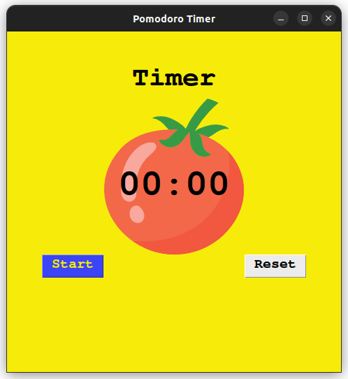
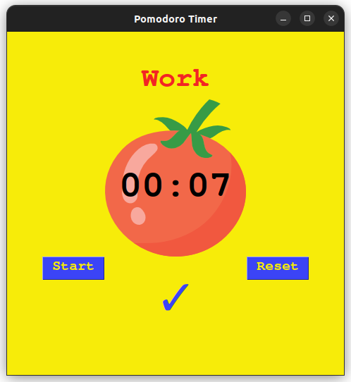
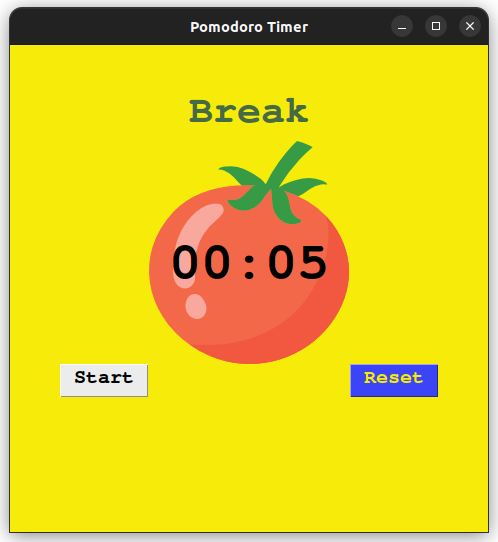
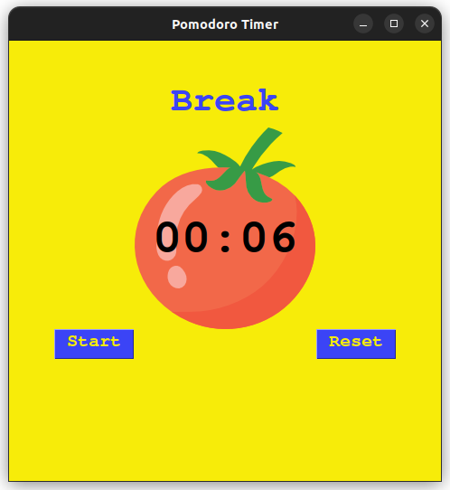

# Pomodoro Timer

### [twitter](https://twitter.com/achte_te)

## Description

A Pomodoro Timer based GUI Application.

## Requirements

[Python](https://www.python.org/)

```sh
$ python3 --version
Python 3.9.12
```

[Tkinter](https://docs.python.org/3/library/tkinter.html)

## Install

```sh
$ git clone git@github.com:achte-2022/Pomodoro-Timer.git
```

## Run

```sh
$ cd Pomodoro-Timer
$ python3 main.py
```

## Application Screen

### Reset Screen



### Work Screen



### Short Break



### Long Break


